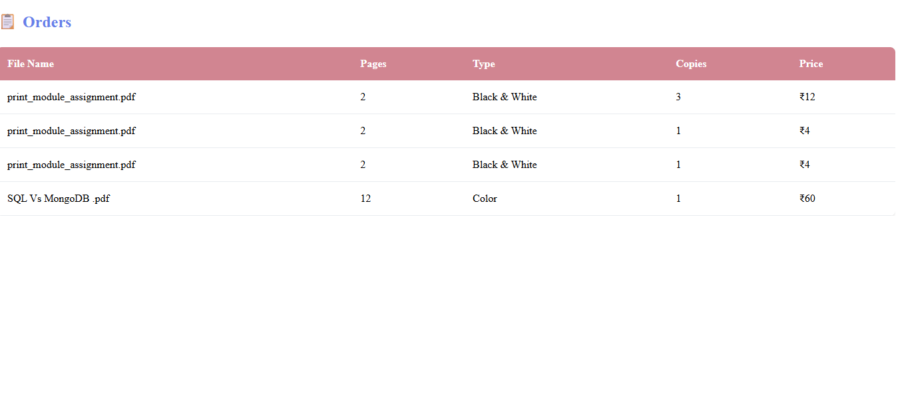
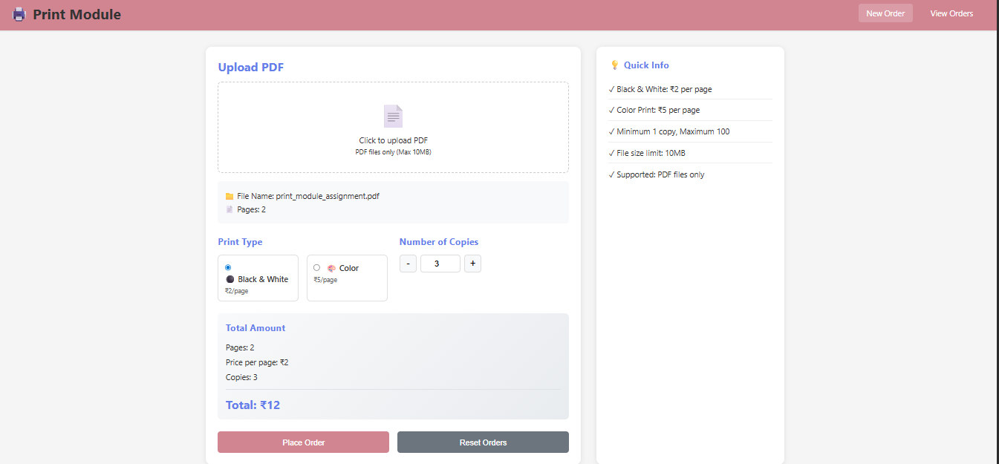

# 🖨️ Print Module

## 📌 Description
A simple full-stack print module system where users can upload a PDF, choose print options, calculate price, and place orders.

---

## 🚀 Features
- Upload PDF file
- Auto page count (pdf.js)
- Select print type (B/W or Color)
- Choose copies (1–100)
- Dynamic price calculation
- Store orders (JSON)
- View orders list

---

## 🛠️ Tech Stack
- HTML, CSS, JavaScript
- Node.js, Express
- pdf.js

---

## ⚙️ Setup

### Backend
cd backend  
npm install  
node server.js  

### Frontend
Open frontend/index.html  

---

## 📸 Screenshots

---

## 👩‍💻 Author
Sumati